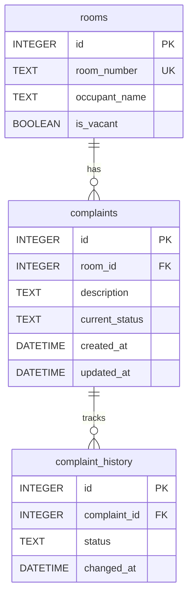

# Hostel Management System

This is the solution for the SIH 2026 Internal Practical Assessment: Hostel Room Allocation and Maintenance Complaint Register.

## Setup and Running the Application

### Option 1: Using Docker (Recommended)
You can run the entire application using Docker and Docker Compose.
1. Ensure Docker and Docker Compose are installed.
2. Clone this repository and navigate to the root directory.
3. Run the following command:
   ```bash
   docker-compose up --build -d
   ```
4. The frontend will be available at `http://localhost:80` and the backend API at `http://localhost:5000`.

### Option 2: Running Locally (Node.js)
1. **Backend:**
   ```bash
   cd backend
   npm install
   npm start
   ```
   *The backend will run on `http://localhost:5000`.*
   *Note: The SQLite database file will be automatically created at `backend/data/hostel.db`.*

2. **Frontend:**
   ```bash
   cd frontend
   npm install
   npm run dev
   ```
   *The frontend will run on `http://localhost:5173`.*

## Database Schema & Logic

### Entity-Relationship (ER) Diagram


### Main Design Decision Justification
Instead of overwriting the status column inside the `complaints` table every time an update occurs, we designed a separate `complaint_history` table. 
**Justification:** A single overwritten column can only answer what the status is *right now*. A separate history table lets the warden track the entire lifecycle of a complaint, including how long each phase took and if it bounced between outstanding and resolved multiple times. This perfectly captures the historical context needed to prevent repeated student complaints from being lost.

- `rooms`: Stores `room_number`, `occupant_name`, and `is_vacant` (Boolean).
- `complaints`: Stores `room_id`, `description`, `current_status` (outstanding/resolved), and timestamps.
- `complaint_history`: Stores the history of status changes for each complaint to avoid losing information by overwriting.

## What Each Field Means
- **Days Outstanding**: A derived figure calculated on the backend. It represents the time elapsed between when the complaint was created and the current server time. 
- **Urgent Attention**: Any outstanding complaint older than 48 hours is highlighted automatically.
- **Occupancy Status**: Shows whether a room is vacant or occupied.

## Outstanding Tasks
- Record a short demonstration video (this requires manual screen recording tools).
