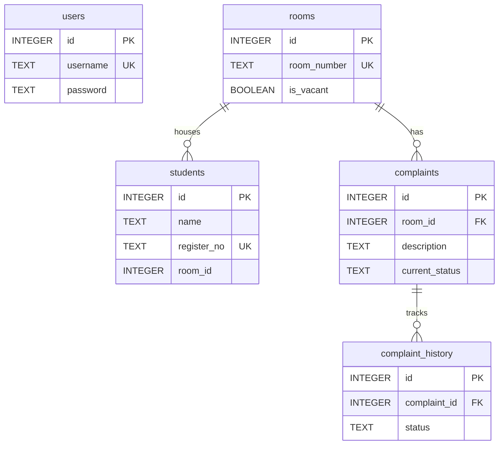

# HostelSync System

This is a fully-fledged, multi-page web application for Hostel Room Allocation and Maintenance Complaint Register.

## 🚀 How to Deploy to the Internet (For Free)

To share this project with friends or evaluators via a public link, you can deploy it for free using **Render.com**.

### Step 1: Push your code to GitHub
Make sure all your code is pushed to your GitHub repository first.

### Step 2: Deploy the Backend (Render Web Service)
1. Go to [Render.com](https://render.com) and sign up for a free account.
2. Click **New +** and select **Web Service**.
3. Connect your GitHub account and select this repository.
4. Set the **Root Directory** to `backend`.
5. Set the **Build Command** to `npm install`.
6. Set the **Start Command** to `npm start`.
7. Select the **Free** tier and click **Create Web Service**.
8. Once deployed, copy the API URL (e.g., `https://hostelsync-api.onrender.com`).

### Step 3: Deploy the Frontend (Render Static Site or Vercel)
1. Go to Render.com, click **New +** and select **Static Site**.
2. Select your repository again.
3. Set the **Root Directory** to `frontend`.
4. Set the **Build Command** to `npm install && npm run build`.
5. Set the **Publish Directory** to `frontend/dist`.
6. **IMPORTANT**: Expand Advanced settings and add an Environment Variable:
   - Key: `VITE_API_URL`
   - Value: `[Paste your Backend API URL from Step 2]`
7. Add a Rewrite Rule (to fix React Router):
   - Source: `/*`
   - Destination: `/index.html`
   - Action: `Rewrite`
8. Click **Create Static Site**.

Once it finishes building, Render will give you a public URL (e.g., `https://hostelsync.onrender.com`) that you can send to anyone!

---

## 💻 Running Locally

### Option 1: Using Docker (Recommended)
```bash
docker-compose up --build -d
```
The frontend will be at `http://localhost:80`.

### Option 2: Running Manually (Node.js)
1. **Backend:**
   ```bash
   cd backend
   npm install
   npm start
   ```

2. **Frontend:**
   ```bash
   cd frontend
   npm install
   npm run dev
   ```
   Open `http://localhost:5173`.

---

### Entity-Relationship (ER) Diagram


### Main Design Decision Justification
Instead of overwriting the status column inside the `complaints` table every time an update occurs, we designed a separate `complaint_history` table. 
**Justification:** A single overwritten column can only answer what the status is *right now*. A separate history table lets the warden track the entire lifecycle of a complaint, including how long each phase took and if it bounced between outstanding and resolved multiple times. This perfectly captures the historical context needed to prevent repeated student complaints from being lost.
